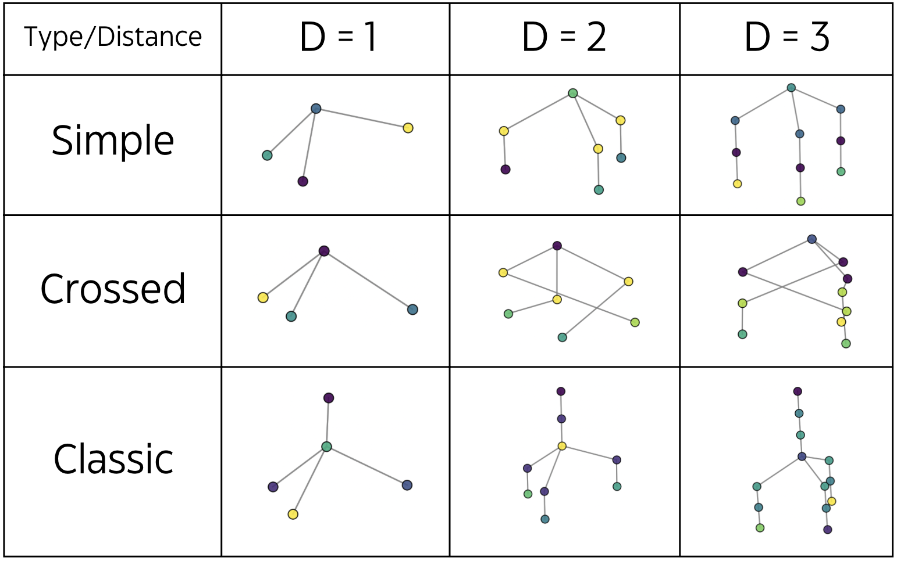

# Chi-Geometry
Welcome to **Chi-Geometry!** A repository to easily generate benchmark datasets for chiral-aware machine learning models.

Chi-Geometry enables you to create and explore chiral configurations without delving into chemistry-specific details. It represents chirality in a purely geometric way, making it ideal for testing model sensitivity to chirality without strict chemical constraints.




## Quick Start

Set up your environment, generate a dataset, and visualize it in just 3 steps:

```bash
# 1. Set up environment
git clone https://github.com/RylieWeaver/Chi-Geometry.git
cd Chi-Geometry
export PYTHONPATH=$(pwd)
conda env create -f environment.yml -n chi-geometry
conda activate chi-geometry

# 2. Generate dataset
cd chi_geometry/dataset
python create_dataset.py

# 3. Visualize dataset (optional)
python plot.py
```


## Configuration Options

Chi-Geometry provides three main configuration options which are read from json:

### Type
This option defines the structural arrangement of the chiral configuration:
- **Simple**: A chiral center with three straightforward chains extending from it.
- **Crossed**: Similar to the simple configuration, but with "crossed" connections between the chains to add complexity.
- **Classic**: Reflects how chirality typically appears in chemistry, with a chiral center connected to four chains.

### Distance
Specifies the number of layers or "steps" between the chiral center and the ends of the chains. All intermediate layers consist of the same atom type, so the unique chiral configuration is only defined at the chain endpoints.

### Species Range
Sets the variety of unique atom types (species) available for random assignment within the chiral configuration, allowing for flexible complexity.


## Quick Example

Set up your environment, generate a dataset, and train an E(3)-equivariant model in just two steps:

```bash
# 1. Set up environment
git clone https://github.com/RylieWeaver/Chi-Geometry.git
cd Chi-Geometry
export PYTHONPATH=$(pwd)
conda env create -f environment.yml -n chi-geometry
conda activate chi-geometry

# 2. Run example
cd examples/classic
python main.py
```
